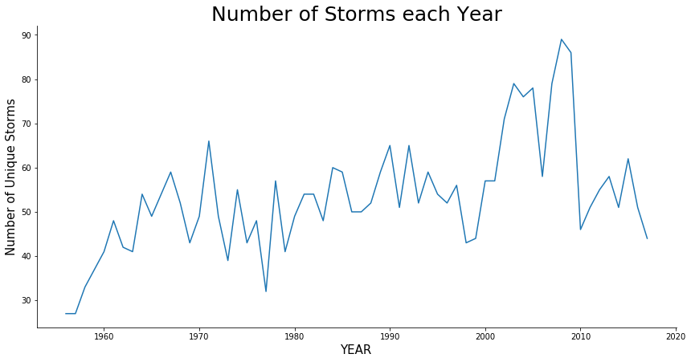
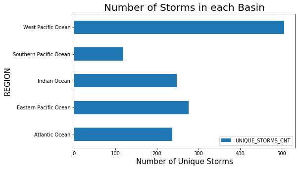
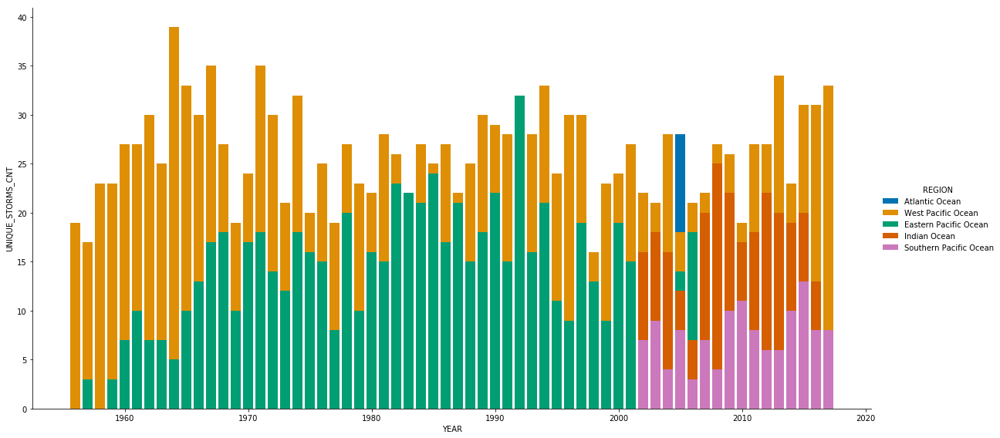
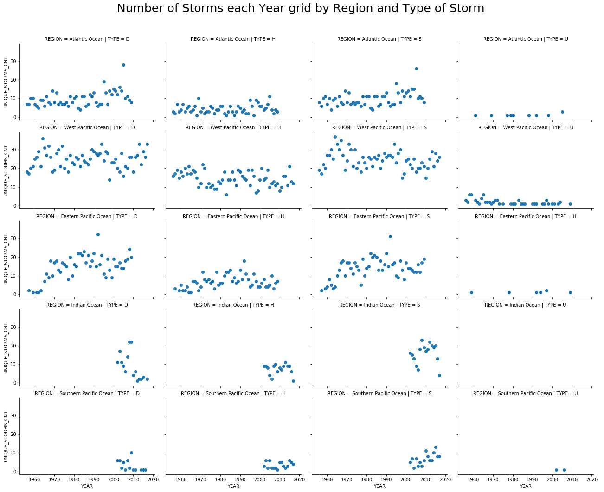
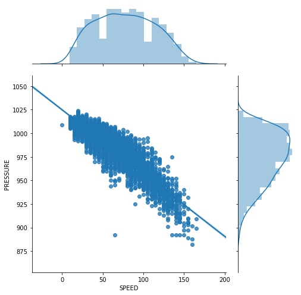
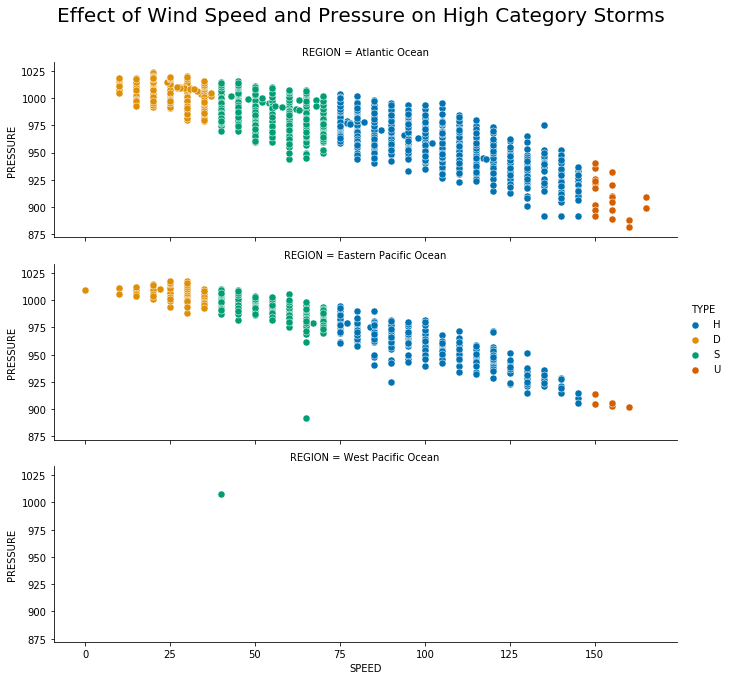
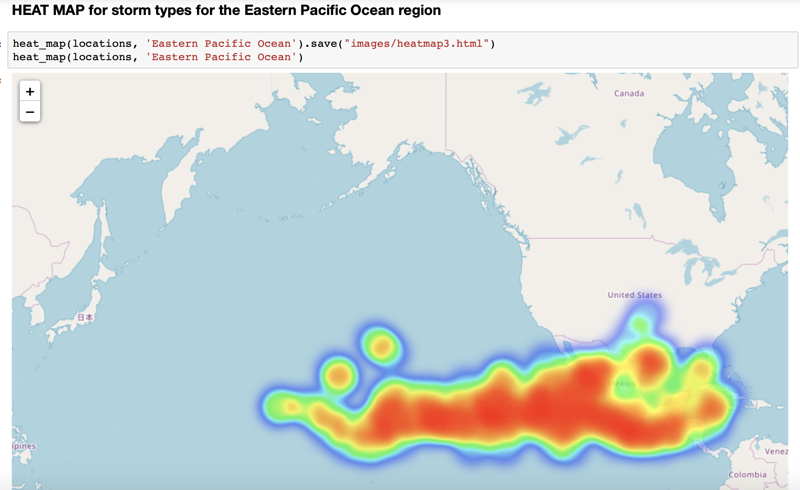

# Historical Storm Data Analysis with Cosmos DB :smiley: fa18-523-57 fa18-523-58

| Divya Rajendran, Pramod Duvvuri
| divrajen@iu.edu, vduvvuri@iu.edu
| Indiana University, Indiana University
| hid: fa18-523-57, fa18-523-58
| github: [:cloud:](https://github.com/cloudmesh-community/fa18-523-57/blob/master/project-report/report.md)
| code: [:cloud:](https://github.com/cloudmesh-community/fa18-523-57/tree/master/project-code)

---

Keywords: e534, fa18-523-57, fa18-523-58, [Data Visualization](#fa18-523-57-58-DV), Data Analysis, Cosmos DB, [Machine Learning](#fa18-523-57-58-ML)

---

## Abstract

The decisions people make these days are all data-driven. The amount of data we collect has increased exponentially and this makes it harder to visualize and understand. We can overcome this hurdle by sampling and visualizing subsets of the data. Sampling refers to the process of collecting random subsets of the data. The only thing one should remember is to pick a good sample of the data or to repeat the process of sampling and visualizing the data subset. In this project, we visualized the historical storm dataset and obtained inferences from our visualizations.

## Introduction

With the disastrous effects of the increasing number of storms all around the world, we thought of taking storm dataset for entire Asia Pacific region and visually analyze the effects of various variables on the storms. We want to check any patterns in the storm data and visualize them geographically so that it might help us to make useful inferences on the storm data. We have identified a data set on data.world[@fa18-523-57-DataSet], a community where we find open datasets from various organizations containing varying data attributes according to the need. We try to identify the various correlations among the attributes and understand if they can help explain the change in frequency of the storms.  

## Implementation

### Data set

The data set for the various storms in Asia Pacific region for the years between 1956 and 2017. We have chosen an initial subset of data to visualize locally and then implement the same visualizations on the entire data. The dataset contains attributes like region, latitude, longitude, type of category, name, date and hour, speed, and pressure. There are more than 190,000 rows in the dataset. We clean the data for any duplicates, null values, and any redundant data before we generate any visualizations.

Our dataset contains five different regions surrounding the oceans like Indian Ocean, Atlantic Ocean, Southern Pacific Ocean, West Pacific Ocean, and Eastern Pacific Ocean and the regions are named according to the ocean covering the locations. We have four different storm types like S for Tropical Storms, H for Hurricanes, D for Depressions, and U for low pressure and high-speed storms.

### Related Work

We identified an earlier work on tropical storm data using R by Stoltzman consulting LLC [@fa18-523-57-related-work] and have used it as a base reference to visualize our data using Python.

## Technologies Used

1. Python [@fa18-523-57-Python] is an object-oriented programming language we have utilized in this project
2. The data is being stored on a Microsoft Azure Cosmos DB [@fa18-523-57-Azure] instance and we will be using Mongo API to connect and retrieve the data. The data is stored in the cloud, we are using an instance of Microsoft Cosmos DB, a NoSQL database, for storage. The output of our visualization is shown in Jupyter notebook.
3. Matplotlib [@fa18-523-57-matplotlib] is a 2D visualization library containing a module plotly which gives us publication-ready images and we aim to utilize this library to show the basic correlation between attributes
4. Seaborn [@fa18-523-57-Seaborn] is a visualization tool based on Matplotlib used to draw attractive statistical plots and we aim to show the change in the number of storms per year and other advanced correlations between different attributes
5. Folium  [@fa18-523-57-Folium] is an interactive mapping tool which plots the data on a map based on the latitude and longitude values
6. For Machine Learning, we use the Python package Scikit-Learn [@fa18-523-58-SKLEARN]

## <a name="fa18-523-57-58-DV"> Data Visualization </a>

This section contains visualizations of the data and the inferences we draw from them and mostly contains our analysis and inferences from them. We attempt to answer a few research question through these visualizations.

1. We start with the basic relationship between the number of unique storms per Year

{#fig:storms_per_year}

We have plotted a linear relationship model between the number of storms and the storm year. We can see from the plot that the rate of increase in the number of unique storms through the years 2000 to 2010 and then reduce to the same rate as between the years 1950 to 1990. But, we cannot assume that the number of storms increased every year, we need to look at other factors such as the correlation between other attributes describing the storms.

2. Number of Storms per basin

{#fig:storms_per_basin}

We plotted a horizontal bar graph between the number of storms occurred in each region and identified that the Western Pacific Ocean region had a higher number of storms than in other regions

3. Number of storms per year per region

{#fig:storms_per_year_per_region}

We plotted a bar graph between the number of storms per year colored by the region in which the storm was observed. The storms were increasing each year in every region and we found that the storms in the region "West Pacific Ocean", were higher than the storms in the region "Eastern Pacific Ocean" during the years 1950 to 1965 and decreased during the years 1965 to 1994. As per our plot, the regions "West Pacific Ocean" and "Eastern Pacific Ocean" had a higher number of storms during 1950 and 2000

4. Number of storms per region per type of storm

{#fig:storms_year_region_type}

We took another step and plotted a pairwise plot between the storm count per region and category type over the years and we observed that in all the five regions, we had a sizable number of storms of types D, H and S when compared to the storm type U

5. The relationship between wind and pressure

{#fig:relation_wind_press_region}

When we plot the linear relationship plot between speed and pressure along with their distributions, we can see that the pressure distribution looks more normal. We clearly observe that the pressure is inversely proportional to speed, that is, higher the speeds lower the pressure and vice-a-versa

6. Correlation between Speed, pressure and category type is identified by visually analyzing them

{#fig:relation_wind_pressure_region}

When we plotted the facetted plot of wind speed, pressure, and category of storm type we observed that the type "D- Depression" storms are of higher pressure and lower speed and storm type "U" is of lower pressure and higher speed. We also observed that the storms of type "S - Tropical Storms" are more prevalent in the region "West Pacific Ocean" and are of lesser speeds when compared to other types of storms.

7. Heat Map of Eastern Pacific region

{#fig:Heat_Map_Eastern_Pacific}

When we plotted a heat map for Eastern Pacific region, we see that the major portion of storms are concentrated in the ocean itself and then as they make landfall the storms decrease in number.

We have created an interactive map showing the distribution of different storm categories and regions. The interactive HTML files are available in this [*folder*](https://github.com/cloudmesh-community/fa18-523-57/tree/master/project-report/images/interactive) and the code for these interactive maps is available in our Jupiter notebook.

## <a name="fa18-523-57-58-ML"> Machine Learning </a>

We used a few sophisticated supervised machine learning algorithms after data cleaning and feature engineering for storm type classification. When the output variable is labeled it is called supervised learning, in our scenario, the output variable is the type of storm. The below diagram best describes the process flow of our project.

{#fig:Flow_Diagram}

### Feature Engineering

This step is common to both data visualization and machine learning. The process of choosing only the necessary features to build the machine learning model is known as *Feature Engineering*. This is an integral part in solving any machine learning problem because our data tends to consist of features which are not helpful in predicting the output.

### Cross Validation

Cross-Validation is a technique that is commonly used in solving most machine learning problems today. The process of repeatedly splitting our data into train-test sets and training a model is known as Cross-Validation. This ensures our machine learning model performs as expected when new data is encountered in the training test. The parameter we need to specify is how many times should the process be repeated. In our project, we set this parameter value to be 5 and 10 to see the accuracy results.

### Multinomial Naive Bayes

Multinomial Naive Bayes (MNB) is a simple classifier that uses the Bayes Theorem and assumes independence between the features and is used for data that follows a Multinomial distribution. We shall use scikit-learn's implementation in our project. The highest accuracy we got was when we used the 70/30 train-test split which gave us an accuracy of split gave us an accuracy of 13.4 % (rounded to the nearest decimal point). MNB tends to perform better when used with nominal data or data that consists of text and hence performs poorly on our data since it has no features which are nominal.

### Logistic Regression

Logistic Regression [@fa18-523-58-LR] is a machine learning algorithm that is used for classification, it uses the natural logarithm function to find the relationship between the independent variable and the target variable, it uses test data to find the coefficients. The function can then predict the future results using these coefficients in the logistic equation. We have used various train/test splits to analyze the accuracy of our model. The highest accuracy we got was when we used the 70/30 train-test split which gave us an accuracy of split gave us an accuracy of 98.4 %.

### Random Forest

Decision Trees are versatile Machine Learning algorithms that can perform both classification and regression tasks and even multi-output tasks. A Decision Tree is the fundamental concept behind a *Random Forest* [@fa18-523-58-RF]. In general, aggregation of answers tends to give a better result, the same technique used in machine learning is called ensemble learning. Instead of using a single classifier we use a group of classifiers or predictors, these group of classifiers usually tend to give a better prediction. When a group of decision trees is trained on a random subset of the training data we get better results. Such groups of decision trees or ensemble are known as a *Random Forest*. This process is also known an *ensemble learning*.  The highest accuracy we got was when we used the 70/30 train-test split which gave us an accuracy of split gave us an accuracy of 98.9 %.

### Support Vector Machines (SVM)

Support Vector Machines [@fa18-523-58-SVM] are sophisticated predictive models in machine learning that are used for *Supervised Learning*. SVMs are highly efficient in performing linear classification. An SVM uses a hyperplane or a set of hyperplanes to perform the task of classification. We have used two different implementations of SVMs in our project. We also implement SVMs with Stochastic Gradient Boosting in our project, this method is discussed in the next sub-section. The highest accuracy we got was when we used the 70/30 train-test split which gave us an accuracy of split gave us an accuracy of 98.4 %.

### SVM with Stochastic Gradient Descent (SGD)

Stochastic Gradient Descent [@fa18-523-58-SGD] (SGD) is a linear classifier under convex loss functions such as (linear) SVMs and Logistic Regression. The efficient application of SGD in large-scale and sparse machine learning problems in recent times has made it popular. For the parameters, we use *elasticnet* for the penalty as it might bring sparsity to the model. We also use 100 as the value for the parameter max_iter. The highest accuracy we got was when we used the 70/30 train-test split which gave us an accuracy of split gave us an accuracy of 98.6 %.

### XGBoost

XGBoost [@fa18-523-58-XGB] is another machine learning algorithm which uses *ensemble learning* like Random Forests. This process of uses a group of gradient boosted trees or ensemble to predict the label. XGBoost is known to be very fast, robust and optimized library. It provides the option of training these group of trees used in the ensemble in a parallel manner to achieve high accuracy, which is very effective in solving data science problems these days. The highest accuracy we got was when we used the 70/30 train-test split which gave us an accuracy of split gave us an accuracy of 98.9 %.

## Summary

From our visualizations, we identified that storms increased each year with different points of origination and that there were many storms in the Western Pacific ocean region than in other regions. We identified that the pressure and speed have an effect on storm type and they separate storms into Hurricanes, Tropical Storms, Depressions, and low-pressure storms. We identified that the higher speed storms are more likely to occur in the West Pacific Ocean region. We hope to study the rise in the storms across different basins on a much deeper level to understand what categories of storms increase in frequency over time.

After applying machine learning algorithms we saw that all the algorithms achieved an accuracy of over 98 % using Cross-Validation with five and ten folds. Before we make any strong conclusions we would like to gather more data and hope our trained model performs well on this new and unseen data examples.

## Future Work

In this project, our main aim was to only visualize the dataset and analyze these visualizations. We would like to identify and uncover more interesting patterns in our data. We hope to use unsupervised machine learning algorithms to find clusters in our data. This might help us identify further patterns in the data that could not have been possible with just plain visualization of the data. The main problem that we have identified in building such a model is the availability of resources required to run the algorithm without any interruption. Using local computer resources for running such a model would not be feasible. Hence, we hope to deploy such a model in the cloud and utilize its power and resources for running such algorithms.

## Acknowledgement

The authors would like to thank Dr. Gregor von Laszewski for giving the opportunity to work on this project and for providing valuable feedback during the duration of our project. The authors would also like to thank the associate instructors of this class for their help and prompt responses to our questions on Piazza. The authors would also like to thank Microsoft for providing a free trial of Azure Cloud services.

## Work Breakdown

The authors Divya Rajendran and Pramod Duvvuri have contributed equally in preparing this report. Divya Rajendran has worked on Data Cleaning, Data Visualization, and Data Analysis. Pramod Duvvuri has worked on setting up the Cosmos DB instance and Machine Learning. Our contributions towards the completion of the project have been updated in our respective notebook markdown files in our respective git repositories.
